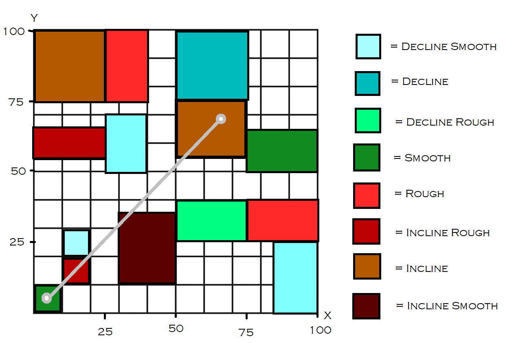
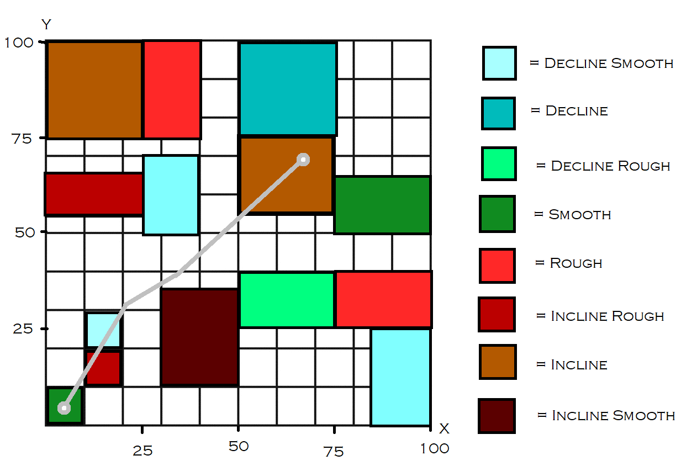
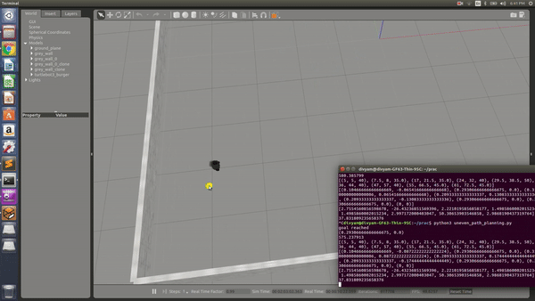

# Path Planning for an Autonomous Vehicle in Uneven Terrain

## Introduction

Path planning for an autonomous vehicle involves the decision making of the robot to move from point A to point B in a given path based on several factors including 
obstacles, path and many more. However, most autonomous vehicles consider the shortest path and not the terrain of the path. The terrain changes brings about an 
additional challenge of consuming extra energy considering the additional frictional constraints that they pose. The approach of this project is to quantify the 
energy difference and understand the performance of an energy-based heuristic function in comparison to the behavior of a distance-based heuristic function as 
defined in a standard A* algorithm.

The project consider the following surfaces of terrain for Motion Planning and Simulation:

- Inclined up
- Inclined down
- Rough 
- Smooth
- Inclined up and rough 
- Inclined up and smooth 
- Inclined down and rough 
- Inclined down and smooth

The distribution of terrains are as follows:

## Requirements

The following are the project dependencies:
- Python 3.5
- ROS Melodic

## Outputs

    <em>A* output</em>

    

    <em>CSA* output</em>

    
    

    <em>ROS simulation</em>

    

